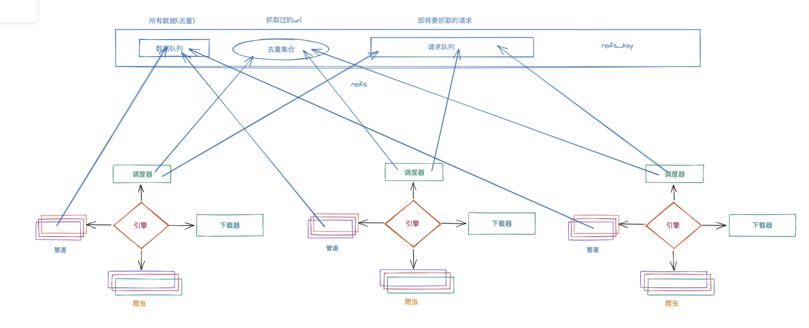

# 分布式爬虫


## 一. 增量式爬虫

​		增量式爬虫, 顾名思义. 可以对网站进行反复抓取. 然后发现新东西了就保存起来. 遇到了以前抓取过的内容就自动过滤掉即可. 其核心思想就两个字. 去重. 并且可以反复去重. 今天运行一下. 明天再运行一下. 将不同的数据过滤出来. 相同的数据去除掉(不保存)即可. 

​		此时, 我们以天涯为目标来尝试一下完成增量式爬虫. 

​		增量爬虫的核心：去除重复， 

  		1. 去除url的重复
  		2. 去除数据的重复

调度器带去除重复的。 用的是集合， python的集合


spider: 

```python
import scrapy
import re
import json
import redis
from scrapy.crawler import Crawler


class WangyiSpider(scrapy.Spider):
    name = "wangyi"
    allowed_domains = ["163.com"]
    start_urls = ["https://news.163.com/special/cm_guonei/?callback=data_callback"]
    wangyi_re_obj = re.compile(r"data_callback\((?P<code>.*)\)",re.S)

    conn = redis.Redis(host="127.0.0.1", port=6379, db=3, password="123456", decode_responses=True)

    def parse(self, resp, **kwargs):
        code = WangyiSpider.wangyi_re_obj.search(resp.text).group("code")
        news_list = json.loads(code)
        for news in news_list:
            tlink = news.get("tlink")
            print(tlink)
            # 如果存在了. 就过
            if self.conn.sismember("wangyi:news:urls", tlink):
                print("搞过了")
            else:
                yield scrapy.Request(
                    url=tlink,
                    callback=self.parse_detail
                )
                print("请求发出去了")

    def parse_detail(self, resp):
        post_title = resp.xpath("//h1[@class='post_title']//text()").extract()
        post_body = resp.xpath("//div[@class='post_body']//text()").extract()
        print(post_title)
        print(post_body)
        self.conn.sadd("wangyi:news:urls", resp.url)

```

​	pipelines

```python
# Define your item pipelines here
#
# Don't forget to add your pipeline to the ITEM_PIPELINES setting
# See: https://docs.scrapy.org/en/latest/topics/item-pipeline.html


# useful for handling different item types with a single interface
from itemadapter import ItemAdapter
from redis import Redis
import json

class TianyaPipeline:

    def process_item(self, item, spider):
        #   2. 数据内容去重. 优点: 保证数据的一致性. 缺点: 需要每次都把数据从网页中提取出来
        print(json.dumps(dict(item)))
       
    	# 如果数据量很大. 建议计算MD5   32位的字符串
        r = self.red.sadd("wangyi:news:items", json.dumps(dict(item)))
        if r:
            # 进入数据库
            print("存入数据库", item['title'])
        else:
            print("已经在数据里了", item['title'])
        return item

    def open_spider(self, spider):
        self.red = Redis(password="123456", db=3)

    def close_spider(self, spider):
        self.red.close()

```

上述方案是直接用redis进行的去重. 我们还可以选择使用数据库,  原理都一样, 不在赘述. 


## 二. 分布式爬虫

​		分布式爬虫, 就是搭建一个分布式的集群, 让其对一组资源进行分布联合爬取. 

​		既然要集群来抓取. 意味着会有好几个爬虫同时运行. 那此时就非常容易产生这样一个问题. 如果有重复的url怎么办?  在原来的程序中. scrapy中会由调度器来自动完成这个任务. 但是, 此时是多个爬虫一起跑. 而我们又知道不同的机器之间是不能直接共享调度器的. 怎么办? 我们可以采用redis来作为各个爬虫的调度器. 此时我们引出一个新的模块叫scrapy-redis. 在该模块中提供了这样一组操作. 它们重写了scrapy中的调度器. 并将调度队列和去除重复的逻辑全部引入到了redis中. 这样就形成了这样一组结构

安装scrapy-redis, 樵夫13期上课时, 最新版本是: 0.9.1    建议同步该版本

对应的scrapy的版本是: 2.11.2

```cmd
pip install scrapy-redis==0.9.1
```



​	整体工作流程:

	1. 某个爬虫从redis_key获取到起始url. 传递给引擎, 到调度器. 然后把起始url直接丢到redis的请求队列里. 开始了scrapy的爬虫抓取工作.  
	2. 如果抓取过程中产生了新的请求. 不论是哪个节点产生的, 最终都会到redis的去重集合中进行判定是否抓取过. 
	3. 如果抓取过. 直接就放弃该请求. 如果没有抓取过. 自动丢到redis请求队列中. 
	4. 调度器继续从redis请求队列里获取要进行抓取的请求. 完成爬虫后续的工作. 

接下来. 我们用scrapy-redis完成上述流程

1. 首先, 创建项目, 和以前一样, 该怎么创建还怎么创建. 

2. 修改Spider, 继承RedisSpider. 将start_urls注释掉. 更换成redis_key

3. 然后再settings中对redis以及scrapy_redis配置一下

    ```python
    REDIS_HOST = "127.0.0.1"
    REDIS_PORT = 6379
    REDIS_DB = 8
    REDIS_PARAMS = {
        "password":"123456"
    }
    
    # scrapy-redis配置信息  # 固定的
    SCHEDULER = "scrapy_redis.scheduler.Scheduler"
    SCHEDULER_PERSIST = True  # 如果为真. 在关闭时自动保存请求信息, 如果为假, 则不保存请求信息
    DUPEFILTER_CLASS = "scrapy_redis.dupefilter.RFPDupeFilter" # 去重的逻辑. 要用redis的
    ITEM_PIPELINES = {
       "shu.pipelines.ShuPipeline": 300,
        # redis提供了一个pipeline. 统一保存数据
        'scrapy_redis.pipelines.RedisPipeline': 301
    }
    
    ```


布隆过滤器(自行研究即可. 对咱们来说, 无意义):

​	平时, 我们如果需要对数据进行去重操作可以有以下方案: 

	1. 直接用set集合来存储url. (最low的方案)
	2. 用set集合存储hash过的url. scrapy默认
	3. 用redis来存储hash过的请求, scrapy-redis默认就是这样做的. 如果请求非常非常多. redis压力是很大的.
	4. 用布隆过滤器. 

布隆过滤器的原理: 其实它里面就是一个改良版的bitmap. 何为bitmap, 假设我提前准备好一个数组, 然后把源数据经过hash计算. 会计算出一个数字. 我们按照下标来找到该下标对应的位置. 然后设置成1. 

```python
a = 李嘉诚
b = 张翠山
....

[0],[0],[0],[0],[0],[0],[0],[0],[0]  10个长度数组

hash(a) => 3
hash(b) => 4

[0],[0],[0],[1],[1],[0],[0],[0],[0] 
# 我想找'张三'
hash('张三') => 6

# 去数组中找6位置的数字。 是0，则不存在'张三'

# 找的时候依然执行该hash算法. 然后直接去找对应下标的位置看看是不是1. 是1就有, 不是1就没有
```

这样有个不好的现象. 容易误判. 如果hash算法选的不够好. 很容易搞错. 那怎么办. 多选几个hash算法

```python
a = 李嘉诚
b = 张翠山

[0],[0],[0],[0],[0],[0],[0],[0],[0],[0]

hash1(a) = 3
hash2(a) = 4

hash1(b) = 2
hash2(b) = 5

[0],[0],[1],[1],[1],[1],[0],[0],[0],[0]

# 找的时候, 重新按照这个hash的顺序, 在重新执行一遍. 依然会得到2个值. 分别去这两个位置看是否是1. 如果全是1, 就有,  如果有一个是0, 就没有. 
```

在scrapy-redis中想要使用布隆过滤器是非常简单的. 你可以自己去写这个布隆过滤器的逻辑. 不过我建议直接用第三方的就可以了

```python

# 安装布隆过滤器
pip install scrapy_redis_bloomfilter

# 去重类，要使用 BloomFilter 请替换 DUPEFILTER_CLASS
DUPEFILTER_CLASS = "scrapy_redis_bloomfilter.dupefilter.RFPDupeFilter"
# 哈希函数的个数，默认为 6，可以自行修改
BLOOMFILTER_HASH_NUMBER = 6
# BloomFilter 的 bit 参数，默认 30，占用 128MB 空间，去重量级 1 亿
BLOOMFILTER_BIT = 30	
```

